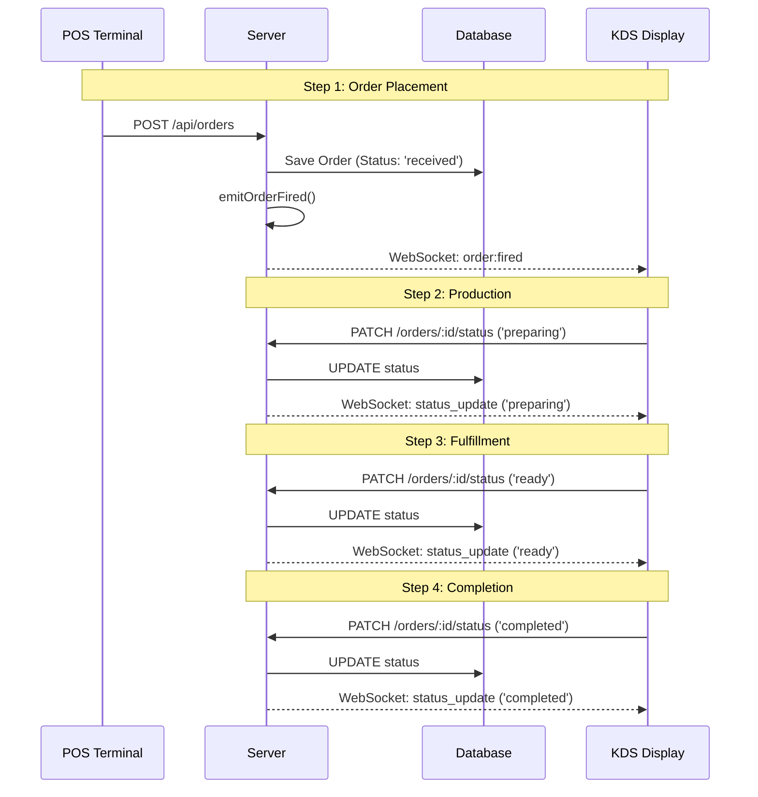

# Kitchen Display System (KDS) Overview

This document provides a comprehensive guide to the Kitchen Display System (KDS) implemented in Nodal POS.

## 🛰️ Real-time Data Flow

The KDS operates using a Pub/Sub model powered by **WebSockets (Socket.io)**. This ensures that as soon as an order is placed at the terminal, it appears on the kitchen screen without manual refreshing.

### 🔄 Order Lifecycle

## 📋 Standard Operating Guidelines

### 1. Receiving Orders
- New orders appear instantly with an **Indigo** header.
- The most recent orders are placed at the beginning of the grid.
- Each card shows the Order ID (last 4 characters) and the elapsed time since creation.

### 2. Status Definitions

| Status | Color | Action | Impact |
| :--- | :--- | :--- | :--- |
| **Received** | Indigo | "Start Cooking" | Moves order to the work queue. |
| **Preparing** | Amber | "Ready for Pickup" | Notifies front-of-house that food is in progress. |
| **Ready** | Emerald | "Complete Order" | Signals the order is finished and waiting for customer. |
| **Completed** | (Hidden) | N/A | Removes order from active KDS display. |

### 3. "Bumping" Orders
The **"BUMP ORDER"** button (Complete Order) should only be pressed once the customer has received their food. This ensures the dashboard analytics accurately reflect "Average Fulfillment Time".

## 🛠️ Technical Details

- **Isolation**: Every store is isolated in its own Socket.io "Room". A kitchen at Store A will never receive orders intended for Store B.
- **Resilience**: If the terminal loses internet, it should be reloaded once online to re-sync state (Phase 2 sync handles this automatically).
- **Latency**: Sub-second synchronization is the target. The "Live" indicator in the header should always be green.

## 🎯 Controlling Monitored Products

To ensure the kitchen only sees items that require preparation (and not retail or merchandise), the system uses a **Category-based filter**.

### How to Configure:
1.  **Flag at Category Level**: In the database/admin UI, each `product_category` has a `send_to_kds` boolean (Default: `TRUE`).
2.  **Inheritance**: All products assigned to a category where `send_to_kds = FALSE` will be automatically excluded from the KDS broadcast.
3.  **Filtering Logic**: The backend order controller filters the items before broadcasting. If an order contains *only* non-KDS items, the kitchen screen will not be notified at all.

### Use Cases:
- **Foods (Main, Sides)**: `send_to_kds = TRUE` (Display in Kitchen)
- **Bottled Drinks**: `send_to_kds = TRUE` (Display at Bar/Kitchen)
- **Retail Merchandise (Mugs, Shirts)**: `send_to_kds = FALSE` (Hide from Kitchen)

---
*Last Updated: 2026-01-30*
*Phase 2: Operational Scale*
