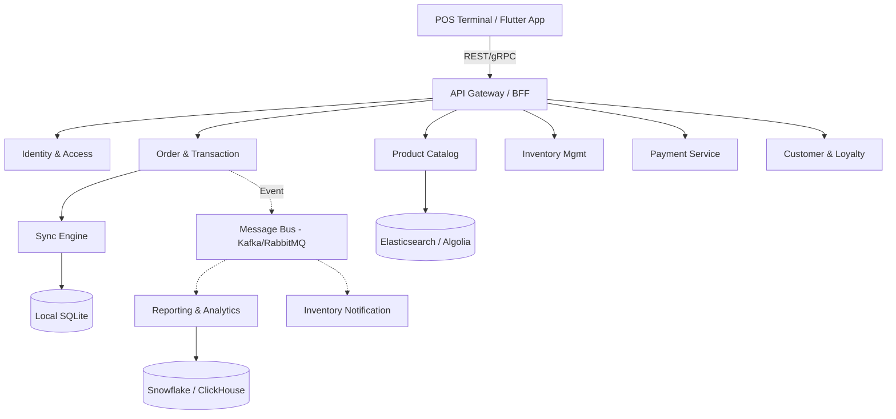

# POS System Architecture Design Document

This document provides a comprehensive technical blueprint for a scalable, high-performance Point of Sale (POS) system tailored for the restaurant and retail sectors.

## 1. Microservices Architecture

The system is decomposed into independent services based on Domain-Driven Design (DDD) principles.

### Architectural Diagram

### Service Boundaries

| Service | Responsibility | Technology Stack Recommendation |
| :--- | :--- | :--- |
| **Identity & Access** | SSO, JWT management, RBAC for staff. | Node.js (TypeScript), Auth0/Keycloak |
| **Catalog** | Product, variants, taxes, menu scheduling. | Go (Golang), MongoDB |
| **Order/Transaction** | Cart logic, payment state, reconciliation. | Go (Golang), PostgreSQL (ACID) |
| **Inventory** | Stock adjustments, multi-location transfers. | Go (Golang), EventStoreDB / Postgres |
| **Loyalty & CRM** | Customer profiles, points, vouchers. | Node.js (TypeScript), PostgreSQL |
| **Reporting** | Real-time and batch sales analysis. | Python (FastAPI), ClickHouse |

---

## 2. Technical Stack Comparison

### Database Strategy
- **Transactional Data (Orders):** **PostgreSQL** with Citus for horizontal scaling.
- **Product Metadata:** **MongoDB** for flexible schemas and varied product attributes.
- **Real-time Metrics:** **Redis** for hot stock levels and transaction locking.
- **Analytics:** **ClickHouse** for sub-second aggregations on historical data.

### Messaging & Event Bus
- **Primary:** **Apache Kafka** for high-throughput event logging and multi-consumer replay.
- **Secondary:** **RabbitMQ** for reliable, ordered delivery of hardware commands (e.g., printing).

---

## 3. Scalability & Resilience

| Concurrent Terminals | Strategy | Infrastructure |
| :--- | :--- | :--- |
| **100** | Vertical Scaling | Single AWS Aurora Instance |
| **1,000** | Read Replicas + Caching | Kubernetes (EKS) + RDS Multi-AZ |
| **10,000+** | Sharded Services + Event-Driven | Sharded Postgres + Global Load Balancing |

### Peak Hour Burst Handling
- **Write-Behind Caching**: Non-critical updates are buffered in Redis.
- **Auto-Scaling**: Kubernetes Horizontal Pod Autoscaler (HPA) targets 60% CPU utilization.
- **Graceful Degradation**: Disable non-essential features (e.g., loyalty points calculation) during extreme load.

---

## 4. Offline-First & Real-Time Sync

### Conflict Resolution: Vector Clocks + LWW
1. **Local Storage**: Every terminal maintains an **SQLite** database for zero-latency operations.
2. **Delta Sync**: Background workers transmit only mutated records (deltas).
3. **Idempotency**: All operations are tagged with client-provided UUIDs to ensure "Exactly Once" processing.
4. **Collision Handling**: Servers handle stock conflicts; Terminals handle UI-level cart conflicts.

---

## 5. Hardware Integration

### Universal Hardware Bridge (UHB)
A local service (Node.JS/Electron or Go) running on the POS hardware acts as a bridge:
- **Printers**: ESC/POS over TCP/USB.
- **Scanners**: HID keyboard emulation or Serial/USB integration.
- **Payments**: Terminal API (Cloud-based) with a local TCP fallback for speed.

---

## 6. Strategic Implementation Priorities

1. **Transaction Core**: Build the Order and Payment services first to ensure revenue capture.
2. **Offline Engine**: Implement the Sync engine early to support unreliable connectivity.
3. **Inventory & Loyalty**: Layer in stock tracking and customer engagement.
4. **Advanced Analytics**: Finalize the OLAP pipeline for business intelligence.
