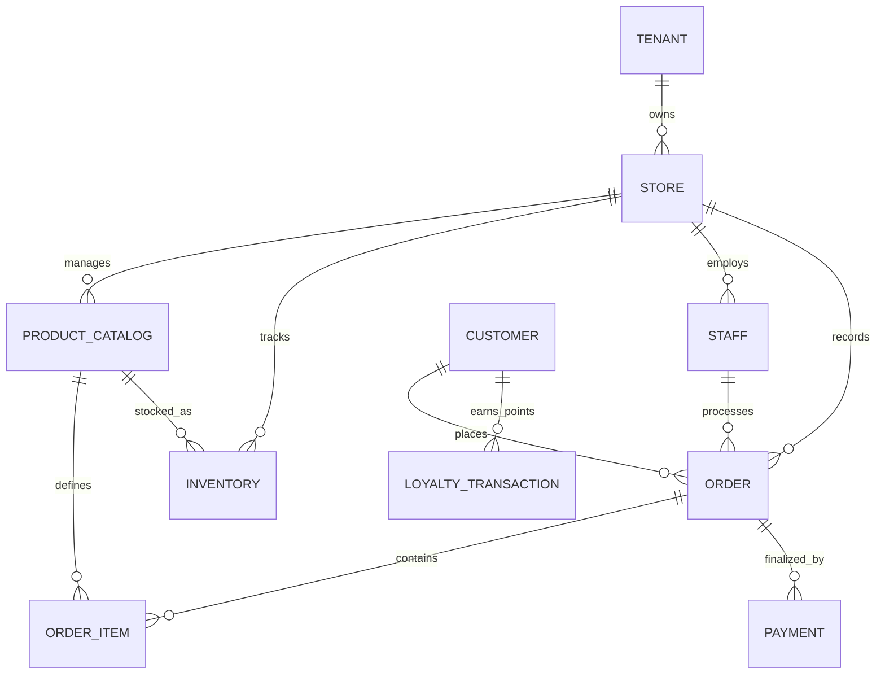

# POS Data Architecture Design

This document provides a deep-dive into the database design for a high-transaction, multi-tenant POS system.

## 1. Entity-Relationship Diagram (ERD)



## 2. Multi-tenant Schema Design

### Strategy: Row-Level Siloing
Every transactional table includes a `tenant_id` column. We utilize PostgreSQL **Row-Level Security (RLS)** to ensure data isolation at the engine level.

```sql
-- Security Policy Example
ALTER TABLE orders ENABLE ROW LEVEL SECURITY;
CREATE POLICY tenant_isolation ON orders USING (tenant_id = current_setting('app.current_tenant')::uuid);
```

### Partitioning Strategy
To maintain performance on tables with billions of rows (Orders/Payments):
- **Range Partitioning**: Partitioned by `created_at` on a monthly basis.
- **Benefits**: Localized indexing, faster vacuuming, and easier data retention management.

---

## 3. Core Database Entities (DDL)

```sql
-- Partitioned Orders Table
CREATE TABLE orders (
    id UUID PRIMARY KEY DEFAULT gen_random_uuid(),
    tenant_id UUID NOT NULL,
    store_id UUID NOT NULL,
    customer_id UUID,
    staff_id UUID NOT NULL,
    order_number SERIAL,
    total_amount DECIMAL(12,2) NOT NULL,
    tax_amount DECIMAL(12,2) NOT NULL,
    status VARCHAR(20) DEFAULT 'completed',
    created_at TIMESTAMP WITH TIME ZONE DEFAULT NOW()
) PARTITION BY RANGE (created_at);

-- Inventory Transaction Log (Event Sourcing Style)
CREATE TABLE inventory_logs (
    id UUID PRIMARY KEY DEFAULT gen_random_uuid(),
    tenant_id UUID NOT NULL,
    store_id UUID NOT NULL,
    product_id UUID NOT NULL,
    change_type VARCHAR(20) NOT NULL, -- 'sale', 'restock', 'return', 'adjustment'
    quantity_change DECIMAL(12,3) NOT NULL,
    reference_id UUID, -- order_id or restock_id
    created_at TIMESTAMP WITH TIME ZONE DEFAULT NOW()
);
```

---

## 4. Performance & Synchronization

### Optimization
- **Materialized Views**: Hourly/Daily aggregations for the management dashboard.
- **GIN Indices**: Full-text search on product names and descriptions.
- **Partial Indices**: Indices on active/pending orders only to reduce heap size.

### Sync & Conflict Resolution
| DataType | Rule | Implementation |
| :--- | :--- | :--- |
| **Orders** | Idempotent | Client-side UUIDs prevent double-counting. |
| **Inventory** | Strict Atomicity | Server-side updates via atomic `UPDATE ... SET qty = qty - X WHERE qty >= X`. |
| **Loyalty** | Eventual Consistency | Points updated via background worker scanning `OrderCreated` events. |

---

## 5. Search & Reporting Queries

### Full-Text Search Example
```sql
CREATE INDEX idx_product_search ON product_catalog USING GIN (to_tsvector('english', name || ' ' || description));

-- Search Query
SELECT name, price 
FROM product_catalog 
WHERE to_tsvector('english', name || ' ' || description) @@ plainto_tsquery('espresso machine');
```

### Complex Reporting Query
```sql
-- Best-selling products per tenant in the last 30 days
SELECT product_id, SUM(quantity) as units_sold
FROM order_items
JOIN orders ON orders.id = order_items.order_id
WHERE orders.tenant_id = :tenant_id
AND orders.created_at > NOW() - INTERVAL '30 days'
GROUP BY product_id
ORDER BY units_sold DESC
LIMIT 10;
```

---

## 6. Migration Strategy
1. **Extraction**: ETL from legacy SQL/CSVs.
2. **Translation**: Mapping IDs to UUIDs and categorizing into `tenant_id` blocks.
3. **Ghost Writing**: Shadow-writing data to the new DB for 48 hours to compare consistency before the final cutover.
