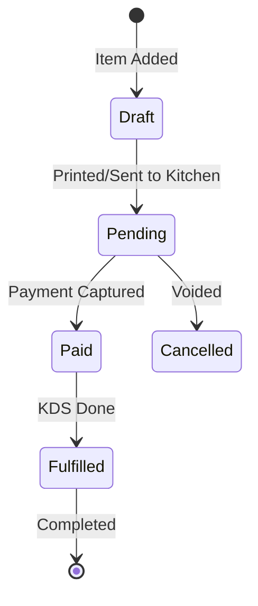
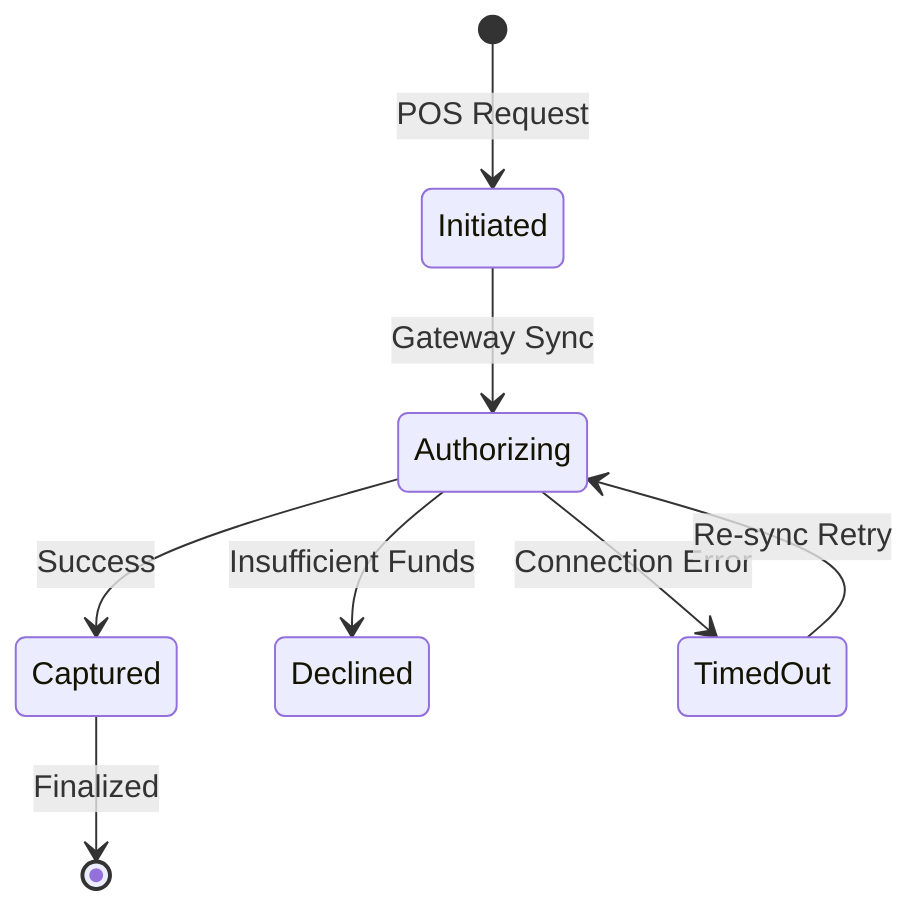

# POS Functional Specification

This document outlines the user personas, core business workflows, and API contracts for a modern, multi-tenant POS system.

## 1. User Personas & Stories

- **Cashier**: Needs high-speed scanning and intuitive checkout during rush hours.
- **Kitchen Staff**: Relies on real-time order visibility and status management via KDS.
- **Manager**: Requires tools for voiding transactions and reviewing shift reports (X-Reports).
- **Business Owner**: Analyzes multi-store performance and inventory margins from a central dashboard.

---

## 2. Core Workflows & Lifecycle

### Order Lifecycle State Machine

### Payment Processing States

### Inventory Update Logic
1. **Soft-lock**: When item is added to cart, a temporary reservation is made (optional).
2. **Hard-decrement**: Upon payment success, the central inventory record is updated via an atomic transaction.
3. **Batch Tracking**: Items are grouped by batch/expiry where applicable for inventory FIFO.

---

## 3. API Contract Specifications

### Key Endpoints (v1)

- **`POST /orders`**: Create a transaction. Supports idempotency via `client_id`.
- **`POST /sync`**: Synchronize offline terminal transactions to the cloud.
- **`PATCH /inventory/batch`**: Update stock levels across multiple locations.
- **`GET /reporting/daily`**: Fetch aggregated sales data for dashboards.

### WebSocket Events
- `ORDER_FIRE`: Notify kitchen of new orders.
- `PAYMENT_RESOLVED`: Notify terminal of gateway status.
- `STOCK_CRITICAL`: Notify manager of low-stock items.

---

## 4. Implementation Priorities

- **Phase 1**: Transaction Core (Orders, Payments, Basic Print).
- **Phase 2**: Real-time Engine (KDS WebSockets, Status Sync).
- **Phase 3**: Advanced Business Logic (Loyalty Tiers, Batch Inventory).
- **Phase 4**: Analytics & Multi-store Dashboards.
