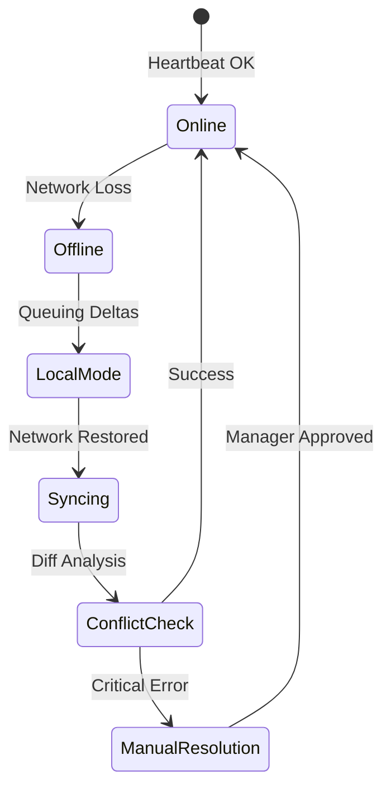

# POS Hardware Integration & Offline Capability Design

This document specifies the architecture for reliable hardware communication and robust offline operations in distributed POS terminals.

## 1. Hardware Abstraction Layer (HAL)

To support diverse hardware, we use a **Bridge Service** (Electron/Go) that exposes a unified WebSocket/gRPC API to the POS UI.

### HAL Interface Design (Pseudocode)
```typescript
interface IPrinterDriver {
  printReceipt(content: ReceiptData): Promise<PrintResult>;
  getStatus(): Promise<PrinterStatus>;
}

class EpsonTM88Driver implements IPrinterDriver {
  async printReceipt(data: ReceiptData) {
    const escPosBuffer = this.compileEscPos(data);
    return await this.usbPipe.write(escPosBuffer);
  }
}

// Universal Hardware Controller
class DeviceManager {
  private printers: Map<string, IPrinterDriver>;
  
  async sendToPrinter(id: string, data: ReceiptData) {
    const printer = this.printers.get(id);
    if (!printer) throw new DeviceNotFoundError();
    return await printer.printReceipt(data);
  }
}
```

### Supported Device Types
- **Printers**: ESC/POS (Epson/Star), StarPRNT, WebPRNT.
- **Scanners**: HID (Keyboard emulation) and Serial/USB (Direct data).
- **Payments**: Terminal API (Adyen/Stripe) via local TCP bridge.
- **KDS**: Secondary displays via WebSocket stream.

---

## 2. Offline-First Architecture

### Local Data Store: SQLite
- **Why**: ACID compliance, rich query support, and better performance than IndexedDB for large catalogs (10k+ items).
- **Structure**: Mirrored schemas of critical cloud tables (Orders, Catalog, Inventory).

### Sync Protocol: Version Vectors
We track changes using **Vector Clocks** (per-device sequence numbers) to handle distributed updates.

#### Sync Algorithm (Pseudocode)
```python
def sync_terminal_to_cloud(terminal_id, last_cloud_sequence):
    # 1. Fetch local deltas since last successful sync
    deltas = local_db.query("SELECT * FROM delta_log WHERE seq > ?", last_cloud_sequence)
    
    # 2. Push to Cloud
    response = cloud_api.post("/sync/push", payload={
        "terminal_id": terminal_id,
        "deltas": deltas,
        "vector_clock": local_vector_clock
    })
    
    # 3. Handle Conflicts (Server Side)
    if response.status == "CONFLICT":
        resolved_data = resolve_conflicts(response.server_data, deltas)
        local_db.apply_patch(resolved_data)
```

### Conflict Resolution Rules
- **Inventory**: **Additive/Subtractive Merge**. (-1 stock on terminal + -1 on another = -2 total on server).
- **Metadata**: **Last-Write-Wins (LWW)** based on NTP-synced device clusters.
- **Fixed State**: Orders are **Immutable**; changes (voids) are appended as new transaction logs.

---

## 3. Device Management & Monitoring

### Remote Operations
- **Config Push**: JSON-based settings (tax rates, menu changes) pushed via MQTT/WebSockets.
- **Health Heartbeat**: Every 60s, terminals report CPU, Memory, Disk, and Peripheral status (e.g., "Printer Offline", "Low Battery").
- **Alerting**: Manager dashboard flags terminals that haven't synced for > 10 minutes.

### Failover
- **Dual-Gateway**: Fallback to LTE/Hotspot if primary WAN fails.
- **Local Bridge Redundancy**: If the main POS fails, KDS can act as a secondary "Read-Only" terminal for order lookup.

---

## 4. Performance & Security

### Optimization for Low-Spec Hardware
- **Binary Search**: Heavily indexed SQLite for instant barcode lookups.
- **UI Virtualization**: Large product lists rendered only for visible area.
- **Lite Sync**: Background worker runs at low priority to avoid UI frame drops.

### Security
- **Data-at-Rest**: SQLite database encrypted with **SQLCipher** (AES-256).
- **Device Auth**: Certificate-based authentication (Mutual TLS) for sync endpoints.
- **Tamper Detection**: Checksum validation of binary assets and hardware-bound tokens in TPM/Keychain.

---

## 5. Transition State Diagram


